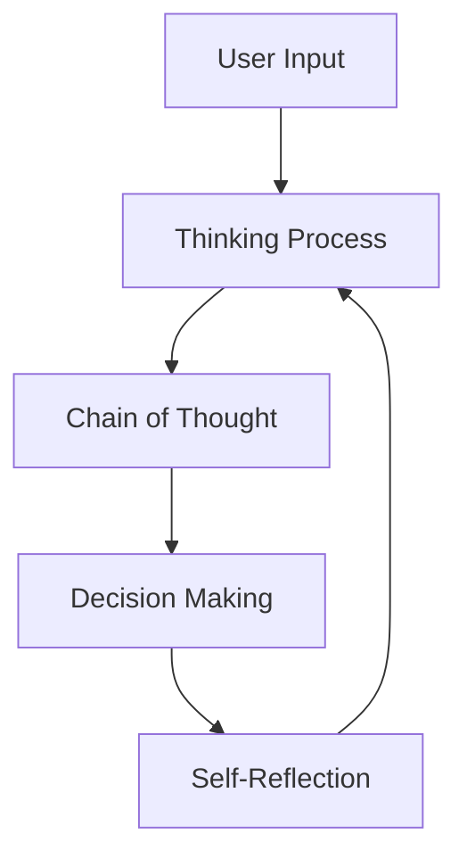

# Building AI Agents
## Models, Tools & Context Integration

<div class="pt-12">
  <span @click="$slidev.nav.next" class="px-2 py-1 rounded cursor-pointer" hover="bg-white bg-opacity-10">
    A comprehensive guide to understanding and building effective AI agents
  </span>
</div>

<div class="abs-br m-6 flex gap-2">
  <a href="https://github.com/slidevjs/slidev" target="_blank" alt="GitHub"
    class="text-xl slidev-icon-btn opacity-50 !border-none !hover:text-white">
    <carbon-logo-github />
  </a>
</div>

---
layout: default
---

# What We'll Cover Today

<div class="grid grid-cols-2 gap-8 mt-8">

<div>

## Core Concepts
- 🤖 **AI Agent Fundamentals**
- 🧠 **Model Capabilities & Characteristics**
- 💭 **Context Management**
- 🛠️ **Tool Integration Strategies**

</div>

<div>

## Implementation
- 📝 **Prompt Engineering**
- 🔧 **Building with Tools**
- 🎯 **Best Practices**
- ⚡ **Performance Optimization**

</div>

</div>

<div class="mt-12 text-center">
  <span class="text-lg opacity-75">From Theory to Practice: Creating Intelligent, Tool-Enabled AI Systems</span>
</div>

---
layout: center
class: text-center
---

# Understanding AI Agents

<div class="text-xl mt-8 opacity-75">
An AI Agent is an intelligent system that combines:
</div>

<div class="grid grid-cols-3 gap-8 mt-12">

<div class="bg-blue-500/20 p-6 rounded-lg">
  <h3 class="text-2xl mb-4">🧠 Models</h3>
  <p>Language models with various capabilities and characteristics</p>
</div>

<div class="bg-purple-500/20 p-6 rounded-lg">
  <h3 class="text-2xl mb-4">💭 Context</h3>
  <p>Accumulated knowledge and conversation history</p>
</div>

<div class="bg-green-500/20 p-6 rounded-lg">
  <h3 class="text-2xl mb-4">🛠️ Tools</h3>
  <p>External functions and APIs that extend agent capabilities</p>
</div>

</div>

---
layout: default
---

# Model Capabilities Overview

<div class="grid grid-cols-2 gap-8">

<div>

## Core Capabilities


- **📏 Context Length**: Variable context windows
- **🛠️ Tool Calling**: External function execution
- **🎭 Multimodal**: Vision, audio, and document processing
- **🧠 Reasoning**: Special layers force models to generate thinking context using advanced prompt techniques


</div>

<div>


## How Reasoning Works



</div>

</div>

---
layout: default
---

# Model Characteristics: Know Your Tools

<div class="grid grid-cols-3 gap-6 mt-8">

<div class="bg-red-500/20 p-6 rounded-lg">

## GPT-4.1

- ⚡ **Super fast** execution
- 📋 **Explicit instructions** required

</div>

<div class="bg-blue-500/20 p-6 rounded-lg">

## Claude Sonnet

- 🤔 **Overthinking** tendency
- 🚀 Goes beyond initial instructions
- 🛠️ **Excellent** tool usage

</div>

<div class="bg-green-500/20 p-6 rounded-lg">

## Gemini

- ⚡ **Quick conclusions**
- 🦘 Tends to jump ahead
- 🌟 **All-round model**

</div>

</div>

<div class="mt-8 text-center">
<div class="bg-yellow-500/20 p-4 rounded-lg inline-block">
💡 <strong>Key Insight:</strong> Choose your model based on task requirements and adjust prompting accordingly
</div>
</div>

---
layout: center
class: text-center
---

# Understanding LLM Models Architecture

<div class="text-3xl mt-8 mb-12">
⚠️ <b>Models are probabilistic, not deterministic</b>
</div>

<div class="grid grid-cols-2 gap-12 mt-8">

<div class="bg-red-500/20 p-8 rounded-lg">
  <h3 class="text-2xl mb-4">❌ Deterministic</h3>
  <p class="text-lg">Same input → Same output</p>
  <p class="text-sm mt-4 opacity-75">Like a calculator: 2+2 always equals 4</p>
</div>

<div class="bg-green-500/20 p-8 rounded-lg">
  <h3 class="text-2xl mb-4">✅ Probabilistic</h3>
  <p class="text-lg">Same input → Variable output</p>
  <p class="text-sm mt-4 opacity-75">Based on learned probability distributions</p>
</div>

</div>

<div class="mt-12 text-xl">
This fundamental characteristic affects <b>everything</b> about how we work with AI agents
</div>

---
layout: default
---

# How LLMs Generate Text: Token by Token

<div class="grid grid-cols-2 gap-8">

<div>

## The Process

1. **Start with input**: "The quick brown fox"
2. **Predict next token**: Based on probability distribution
3. **Randomly select token**: "jumps" (45% chance)
4. **Update context**: "The quick brown fox jumps"
5. **Repeat**: Generate next token candidates

<div class="mt-6 bg-blue-500/20 p-4 rounded-lg">
<h4 class="font-bold mb-2">Key Insight:</h4>
<p class="text-sm">Each token generation is independent, based on current context</p>
</div>

</div>

<div>

<div class="bg-gray-900 p-6 rounded-lg">
  <div id="token-sequence" class="mb-6">
    <div class="text-lg font-mono mb-4">
      <span class="text-blue-300" id="current-sequence">The quick brown fox</span>
      <span class="text-yellow-300 ml-2" id="next-token"></span>
    </div>
  </div>
  
  <div id="candidate-tokens" class="space-y-2">
    <!-- Token candidates will be shown here -->
  </div>
  
  <div class="mt-6 flex gap-4">
    <button id="reset-btn" class="bg-blue-600 hover:bg-blue-700 px-4 py-2 rounded text-sm">
      Reset
    </button>
    <button id="auto-generate" class="bg-green-600 hover:bg-green-700 px-4 py-2 rounded text-sm">
      Auto Generate
    </button>
  </div>
</div>

</div>

</div>

<script setup>
import { onMounted } from 'vue'

onMounted(() => {
  const currentSequence = document.getElementById('current-sequence')
  const nextToken = document.getElementById('next-token')
  const candidateTokens = document.getElementById('candidate-tokens')
  const resetBtn = document.getElementById('reset-btn')
  const autoGenerate = document.getElementById('auto-generate')
  
  let isAutoGenerating = false
  let autoInterval = null
  
  // Token probability scenarios for different contexts
  const tokenScenarios = {
    "The quick brown fox": [
      { token: "jumps", prob: 0.45, color: "bg-green-500" },
      { token: "runs", prob: 0.25, color: "bg-blue-500" },
      { token: "walks", prob: 0.15, color: "bg-purple-500" },
      { token: "flies", prob: 0.10, color: "bg-orange-500" },
      { token: "sleeps", prob: 0.05, color: "bg-gray-500" }
    ],
    "The quick brown fox jumps": [
      { token: "over", prob: 0.60, color: "bg-green-500" },
      { token: "through", prob: 0.20, color: "bg-blue-500" },
      { token: "across", prob: 0.12, color: "bg-purple-500" },
      { token: "around", prob: 0.05, color: "bg-orange-500" },
      { token: "under", prob: 0.03, color: "bg-gray-500" }
    ],
    "The quick brown fox jumps over": [
      { token: "the", prob: 0.70, color: "bg-green-500" },
      { token: "a", prob: 0.20, color: "bg-blue-500" },
      { token: "an", prob: 0.05, color: "bg-purple-500" },
      { token: "some", prob: 0.03, color: "bg-orange-500" },
      { token: "several", prob: 0.02, color: "bg-gray-500" }
    ],
    "The quick brown fox jumps over the": [
      { token: "lazy", prob: 0.50, color: "bg-green-500" },
      { token: "sleeping", prob: 0.20, color: "bg-blue-500" },
      { token: "old", prob: 0.15, color: "bg-purple-500" },
      { token: "big", prob: 0.10, color: "bg-orange-500" },
      { token: "small", prob: 0.05, color: "bg-gray-500" }
    ],
    "The quick brown fox jumps over the lazy": [
      { token: "dog", prob: 0.80, color: "bg-green-500" },
      { token: "cat", prob: 0.10, color: "bg-blue-500" },
      { token: "bear", prob: 0.05, color: "bg-purple-500" },
      { token: "horse", prob: 0.03, color: "bg-orange-500" },
      { token: "cow", prob: 0.02, color: "bg-gray-500" }
    ]
  }
  
  function updateCandidateTokens(sequence) {
    const candidates = tokenScenarios[sequence] || []
    candidateTokens.innerHTML = ''
    
    if (candidates.length === 0) {
      candidateTokens.innerHTML = '<div class="text-gray-400 text-center">End of sequence</div>'
      return
    }
    
    candidates.forEach((candidate, index) => {
      const tokenDiv = document.createElement('div')
      tokenDiv.className = `flex items-center justify-between p-3 rounded cursor-pointer hover:opacity-80 transition-all ${candidate.color}`
      
      tokenDiv.innerHTML = `
        <span class="font-mono font-bold">${candidate.token}</span>
        <div class="flex items-center space-x-2">
          <div class="w-16 bg-white bg-opacity-20 rounded-full h-2">
            <div class="h-2 bg-white rounded-full transition-all duration-500" style="width: ${candidate.prob * 100}%"></div>
          </div>
          <span class="text-sm">${(candidate.prob * 100).toFixed(1)}%</span>
        </div>
      `
      
      tokenDiv.addEventListener('click', () => {
        const newSequence = sequence + ' ' + candidate.token
        currentSequence.textContent = newSequence
        nextToken.textContent = ''
        updateCandidateTokens(newSequence)
      })
      
      candidateTokens.appendChild(tokenDiv)
    })
  }
  
  function resetSequence() {
    currentSequence.textContent = 'The quick brown fox'
    nextToken.textContent = ''
    updateCandidateTokens('The quick brown fox')
    stopAutoGenerate()
  }
  
  function generateNextToken() {
    const currentSeq = currentSequence.textContent
    const candidates = tokenScenarios[currentSeq]
    
    if (!candidates || candidates.length === 0) {
      stopAutoGenerate()
      return
    }
    
    // Simulate probabilistic selection (weighted random)
    const rand = Math.random()
    let cumulative = 0
    let selectedToken = candidates[0]
    
    for (const candidate of candidates) {
      cumulative += candidate.prob
      if (rand <= cumulative) {
        selectedToken = candidate
        break
      }
    }
    
    const newSequence = currentSeq + ' ' + selectedToken.token
    currentSequence.textContent = newSequence
    updateCandidateTokens(newSequence)
  }
  
  function stopAutoGenerate() {
    isAutoGenerating = false
    if (autoInterval) {
      clearInterval(autoInterval)
      autoInterval = null
    }
    autoGenerate.textContent = 'Auto Generate'
    autoGenerate.className = 'bg-green-600 hover:bg-green-700 px-4 py-2 rounded text-sm'
  }
  
  resetBtn.addEventListener('click', resetSequence)
  
  autoGenerate.addEventListener('click', () => {
    if (isAutoGenerating) {
      stopAutoGenerate()
    } else {
      isAutoGenerating = true
      autoGenerate.textContent = 'Stop Auto'
      autoGenerate.className = 'bg-red-600 hover:bg-red-700 px-4 py-2 rounded text-sm'
      
      autoInterval = setInterval(generateNextToken, 2000) // Generate every 2 seconds
    }
  })
  
  // Initialize
  updateCandidateTokens('The quick brown fox')
})
</script>

<!-- --- -->
<!-- src: ./pages/model-parameters.md -->
<!-- --- -->

---
layout: default
---

# Understanding Hallucinations

<div class="grid grid-cols-2 gap-6">

<div>

## Common Causes

<v-clicks>

<div>

1. **📄 Irrelevant Context**
   - Too much noise in prompt

2. **❌ Bad Input Prompts**  
   - Unclear instructions

3. **📊 Premise Order**
   - Information sequencing matters

</div>
</v-clicks>

</div>

<div>

## Prevention Strategies

<v-clicks>
<div>

- **📝 Good Structured and concised system prompt**
- **🎯 Cleared and detailed user input prompt**
- **🔧 "Fix" the context when seeing hallucinations, DONT chain hallucinations**
- **⚠️ Avoid to use reasoning model**

</div>
</v-clicks>

<div class="mt-4 text-sm opacity-75">
Proactive approaches to minimize hallucination risk
</div>

</div>

</div>

---
layout: center
class: text-center
---

# Context: The Agent's Memory

<div class="text-xl mt-8 opacity-75">
"Garbage In, Garbage Out" - Context Quality Determines Agent Performance
</div>

<div class="grid grid-cols-2 gap-12 mt-12">

<div class="bg-blue-500/20 p-8 rounded-lg">
  <h3 class="text-2xl mb-4">📝 What Goes In</h3>
  <ul class="text-left space-y-2">
    <li>System prompts</li>
    <li>User messages</li>
    <li>Tool results</li>
    <li>Dynamic content</li>
  </ul>
</div>

<div class="bg-green-500/20 p-8 rounded-lg">
  <h3 class="text-2xl mb-4">🧠 How It's Used</h3>
  <ul class="text-left space-y-2">
    <li>Accumulative context</li>
    <li>Pattern recognition</li>
    <li>Tool uses</li>
  </ul>
</div>

</div>

---
layout: default
---

# Context Components Deep Dive

<div class="grid grid-cols-2 gap-6">

<div>

## System Prompt
*Define behavior and rules*

```markdown
# Role
You are a specialized AI assistant...

# Responsibilities  
- Analyze user requirements
- Provide accurate solutions
- Follow security guidelines

# Framework
Use ReAct: Reason → Act → Observe

# Constraints
- Never modify production data
- Always explain your reasoning
```

</div>

<div>

## Dynamic Content

**📚 RAG (Retrieval Augmented Generation)**
- Based on user input
- Controllable knowledge injection
- Model independent

**🛠️ Tool Results**
- Deterministic responses
- Expandable
- Model control over execution

</div>

</div>

---
layout: default
---

# Prompt Engineering Frameworks

<div class="grid grid-cols-3 gap-3">

<div class="bg-blue-500/20 p-3 rounded-lg">

## ReAct Framework

<v-clicks>
<div>

**Reason** → **Act** → **Observe**

```
Thought: I need to find sales data
Action: search_database("Q3 sales")
Observation: Found 150 records
Thought: Now I'll analyze trends
Action: analyze_trends(data)
```

*Structured decision making*

</div>
</v-clicks>

</div>

<div class="bg-green-500/20 p-3 rounded-lg">

## Chain-of-Thought

<v-clicks>
<div>

**Step-by-step reasoning**

```
Let me think through this:
1. First, understand the problem
2. Break it into smaller parts  
3. Solve each part
4. Combine solutions
5. Verify the result
```

*Transparent thinking process*

</div>
</v-clicks>

</div>

<div class="bg-purple-500/20 p-3 rounded-lg">

## Self-Consistency

<v-clicks>
<div>

**Multiple reasoning paths**

```
Approach 1: Direct calculation
Approach 2: Step-by-step  
Approach 3: Alternative method

Compare results and choose
the most consistent answer
```

*Improved accuracy*
</div>

</v-clicks>

</div>

</div>

---
layout: default
---

# User Prompt: Guiding Agent success

<div class="grid grid-cols-2 gap-8">

<div>

## What User Prompt Includes

- **📝 Clear instructions** with specific task description
- **📎 Attached files** (code, docs, images)
- **🎯 Context acquisition guidance** (which files to examine, what should agent to search for)
- **✅ Success criteria** and expected outcomes

</div>

<div>

## Critical Guidelines

<div class="bg-blue-500/20 p-3 rounded-lg mb-3">
<h4 class="font-bold text-sm">📋 Be Specific</h4>
<p class="text-xs">Define clear tasks, constraints, and format requirements</p>
</div>

<div class="bg-orange-500/20 p-3 rounded-lg">
<h4 class="font-bold text-sm">⚠️ Accumulative Effect</h4>
<p class="text-xs">Each prompt and tool uses adds to conversation history - context grows with every interaction</p>
</div>

</div>

</div>

---
layout: default
---

# Context Control Strategies

<div class="grid grid-cols-2 gap-8">

<div>

## Management Techniques

1. **📋 Task Tracking**
   - Tracking outside of context (file, memory, etc...)
   - Track completion status
   - Independent task
   - Maintain focus

2. **🗜️ Context Compression**
   - Summarize old conversations
   - Remove irrelevant details
   - Preserve key insights

</div>

<div>

## Examples

<div class="space-y-4" style="overflow: auto;max-height: 350px;">

<div class="bg-blue-500/20 p-4 rounded-lg">
<h4 class="font-bold text-sm mb-2">Cursor</h4>
<ul class="text-sm space-y-1">
<li><b>Staging complexity</b>: Break large tasks into smaller chunks</li>
<li><b>Context awareness</b>: built with contextual awareness at its core and is designed to require minimal intervention from the user</li>
</ul>
</div>

<div class="bg-green-500/20 p-4 rounded-lg">
<h4 class="font-bold text-sm mb-2">GitHub Copilot</h4>
<ul class="text-sm space-y-1">
<li><b>Intelligent truncation</b>: Keeps most relevant portions, discards older/less pertinent info</li>
<li><b>Neighboring priority</b>: Focuses on open tabs and related files for context relationships</li>
</ul>
</div>

<div class="bg-purple-500/20 p-4 rounded-lg">
<h4 class="font-bold text-sm mb-2">Manus</h4>
<ul class="text-sm space-y-1">
<li><b>Event summarization</b>: Distills completed sub-tasks into brief notes, drops irrelevant events</li>
<li><b>File segregation</b>: Saves important info to notes.txt to free up context space</li>
</ul>
</div>

</div>

</div>

</div>

---
layout: center
class: text-center
---

# Tools: Extending Agent Capabilities

<div class="text-2xl mt-8">
🛠️ <b>Tools transform AI from conversational to actionable</b>
</div>

<div class="grid grid-cols-3 gap-6 mt-12">

<div class="bg-blue-500/20 p-4 rounded-lg">
  <h4 class="text-lg font-bold">Built-in Tools</h4>
  <p class="text-sm">Read, Write, Search, Analyze</p>
</div>

<div class="bg-green-500/20 p-4 rounded-lg">
  <h4 class="text-lg font-bold">Model-Native</h4>
  <p class="text-sm">Search, Computer Use, Browser use</p>
</div>

<div class="bg-purple-500/20 p-4 rounded-lg">
  <h4 class="text-lg font-bold">MCPs</h4>
  <p class="text-sm">Endless External Capabilities</p>
</div>

</div>

---
layout: default
---

# Tool Categories & Implementation

<div class="grid grid-cols-2 gap-8">

<div>

## Built-in Tools
*Available in Cursor, Copilot, Claude Code*

- 📖 **Read File** - Access file contents
- ✏️ **Write File** - Create/modify files  
- 🔍 **Search Pattern** - Find code patterns
- 📊 **Analyze Repo** - Repository analysis

## Model-Native Tools
*Platform-specific capabilities*

- 🌐 **Grounded Search** - Web search with sources
- 💻 **Computer Use** - Desktop automation
- 🌍 **Browser Use** - Web interaction

</div>

<div>

## MCPs (Model Context Protocol)
*Connect to any external service*

```json
{
  "mcpServers": {
    "playwright": {
      "command": "npx",
      "args": [
        "@playwright/mcp@latest",
        "--headless"
      ]
    }
  }
}
```

<div class="mt-4 bg-green-500/20 p-3 rounded">
✨ <strong>Endless Capabilities:</strong> Database access, API integration, custom workflows
</div>

</div>

</div>

---
layout: default
---

# Tool Usage Best Practices

<div class="text-center">

## Key Considerations

<div class="grid grid-cols-3 gap-6 mt-8">

<div class="bg-red-500/20 p-6 rounded-lg">

<div class="text-center font-bold mb-4">🔒 Scoping Permissions</div>
<div class="text-left">
<ul class="space-y-1">
<li>Grant minimal necessary access</li>
<li>Audit tool capabilities regularly</li>
<li>Consider security implications</li>
</ul>
</div>

</div>

<div class="bg-blue-500/20 p-6 rounded-lg">

<div class="text-center font-bold mb-4">⚡ Model Efficiency</div>
<div class="text-left">
<ul class="space-y-1">
<li><b>Claude</b>: Excellent tool usage</li>
<li><b>GPT-4</b>: Needs explicit instructions</li>
<li><b>Gemini</b>: Quick but may skip steps</li>
</ul>
</div>

</div>

<div class="bg-green-500/20 p-6 rounded-lg">

<div class="text-center font-bold mb-4">🎯 Monitoring & Control</div>
<div class="text-left">
<ul class="space-y-1">
<li>Monitor tool call patterns</li>
<li>Review tool call arguments</li>
<li>Use approval tool for accept/reject tool use</li>
</ul>
</div>

</div>

</div>

</div>

---
layout: default
---

# Building Your First AI Agent

<div class="grid grid-cols-2 gap-8">

<div>

## Implementation Steps


1. **🎯 Define Purpose**
   - Clear objectives and target use cases
   - Define success metrics and constraints

2. **💭 Design Context**
   - Craft effective system prompt
   - Build Adaptive behavior for precise control


</div>

<div>


3. **🛠️ Choose Tools**
   - Identify required capabilities
   - Find official or popular tools
   - Keep the tool set minimal initially

4. **🧪 Test & Iterate**
   - Start with simple use cases
   - Add complexity gradually
   - Monitor performance and adjust


</div>

</div>

---
layout: center
class: text-center
---

# Key Takeaways

<div class="grid grid-cols-2 gap-12 mt-12">

<div class="text-left">

## 🎯 **Success Formula**


- **Right Model** for the task
- **Quality Context** for decisions
- **Appropriate Tools** for capabilities  
- **Clear Instructions** for behavior


</div>

<div class="text-left">

## 🚀 **Next Steps**


- Start with simple single-purpose agents
- Experiment with different models
- Build tool libraries incrementally
- Monitor and iterate constantly


</div>

</div>

<div class="mt-12">
<div class="bg-gradient-to-r from-blue-500/20 to-purple-500/20 p-6 rounded-lg">
<strong>Remember:</strong> AI Agents are powerful when Models + Context + Tools work in harmony
</div>
</div>

---
layout: center
class: text-center
---

# Thank You!

<div class="text-2xl mt-8">
Questions & Discussion
</div>

<div class="grid grid-cols-3 gap-8 mt-12">

<div class="bg-blue-500/20 p-6 rounded-lg">
  <h3 class="text-xl mb-4">🤔 Questions?</h3>
  <p>Let's discuss implementation challenges</p>
</div>

<div class="bg-green-500/20 p-6 rounded-lg">
  <h3 class="text-xl mb-4">🛠️ Want to Build?</h3>
  <p>Let's explore specific use cases</p>
</div>

<div class="bg-purple-500/20 p-6 rounded-lg">
  <h3 class="text-xl mb-4">📚 Resources</h3>
  <p><a href="https://www.reddit.com/r/LocalLLaMA/comments/17vonjo/your_settings_are_probably_hurting_your_model_why/">Explaination of LLM parameters</a></p>
  <p><a href="https://mm.tt/map/3759810974?t=cSqEz2xhtP">Summary Mind map</a></p>
</div>

</div>

<div class="mt-12 text-lg opacity-75">
Contact: quy.truong@saigontechnology.com
</div>

