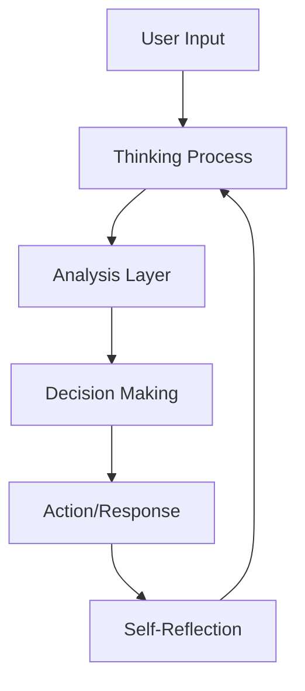

# Building AI Agents
## Models, Tools & Context Integration

<div class="pt-12">
  <span @click="$slidev.nav.next" class="px-2 py-1 rounded cursor-pointer" hover="bg-white bg-opacity-10">
    A comprehensive guide to understanding and building effective AI agents
  </span>
</div>

<div class="abs-br m-6 flex gap-2">
  <a href="https://github.com/slidevjs/slidev" target="_blank" alt="GitHub"
    class="text-xl slidev-icon-btn opacity-50 !border-none !hover:text-white">
    <carbon-logo-github />
  </a>
</div>

---
layout: default
---

# What We'll Cover Today

<div class="grid grid-cols-2 gap-8 mt-8">

<div>

## Core Concepts
- 🤖 **AI Agent Fundamentals**
- 🧠 **Model Capabilities & Characteristics**
- 💭 **Context Management**
- 🛠️ **Tool Integration Strategies**

</div>

<div>

## Implementation
- 📝 **Prompt Engineering**
- 🔧 **Building with Tools**
- 🎯 **Best Practices**
- ⚡ **Performance Optimization**

</div>

</div>

<div class="mt-12 text-center">
  <span class="text-lg opacity-75">From Theory to Practice: Creating Intelligent, Tool-Enabled AI Systems</span>
</div>

---
layout: center
class: text-center
---

# Understanding AI Agents

<div class="text-xl mt-8 opacity-75">
An AI Agent is an intelligent system that combines:
</div>

<div class="grid grid-cols-3 gap-8 mt-12">

<div class="bg-blue-500/20 p-6 rounded-lg">
  <h3 class="text-2xl mb-4">🧠 Models</h3>
  <p>Language models with various capabilities and characteristics</p>
</div>

<div class="bg-purple-500/20 p-6 rounded-lg">
  <h3 class="text-2xl mb-4">💭 Context</h3>
  <p>Accumulated knowledge and conversation history</p>
</div>

<div class="bg-green-500/20 p-6 rounded-lg">
  <h3 class="text-2xl mb-4">🛠️ Tools</h3>
  <p>External functions and APIs that extend agent capabilities</p>
</div>

</div>

---
layout: default
---

# Model Capabilities Overview

<div class="grid grid-cols-2 gap-8">

<div>

## Core Capabilities

<v-clicks>

- **📏 Context Length**: Variable context windows
- **🛠️ Tool Calling**: External function execution
- **🔍 Vision**: Native image understanding
- **🔊 Audio**: Native audio processing
- **📄 PDF Processing**: Native document parsing
- **🧠 Reasoning**: Advanced thinking processes

</v-clicks>

</div>

<div>

<v-clicks at="7">

## How Reasoning Works

<div style="overflow: auto; max-height: 300px;">



</div>

<div class="text-sm mt-4 opacity-75">
Special layers force models to generate thinking context using advanced prompt techniques
</div>

</v-clicks>

</div>

</div>

---
layout: center
class: text-center
---

# Understanding LLM Models Architecture

<div class="text-3xl mt-8 mb-12">
⚠️ <b>Models are probabilistic, not deterministic</b>
</div>

<div class="grid grid-cols-2 gap-12 mt-8">

<div class="bg-red-500/20 p-8 rounded-lg">
  <h3 class="text-2xl mb-4">❌ Deterministic</h3>
  <p class="text-lg">Same input → Same output</p>
  <p class="text-sm mt-4 opacity-75">Like a calculator: 2+2 always equals 4</p>
</div>

<div class="bg-green-500/20 p-8 rounded-lg">
  <h3 class="text-2xl mb-4">✅ Probabilistic</h3>
  <p class="text-lg">Same input → Variable output</p>
  <p class="text-sm mt-4 opacity-75">Based on learned probability distributions</p>
</div>

</div>

<div class="mt-12 text-xl">
This fundamental characteristic affects <b>everything</b> about how we work with AI agents
</div>

---
layout: default
---

# Model Parameters: Fine-Tuning Probabilistic

<div class="grid grid-cols-2 gap-8">

<div>

## Probability Control

```python {1|2-3|4-5|6-7|8-9}
# Model parameters affect token selection
temperature = 0.7    # Controls randomness
top_p = 0.9         # Cumulative probability
top_k = 50          # Fixed token count
min_p = 0.05        # Baseline probability

# Lower temperature = more deterministic
# Higher temperature = more creative
```

</div>

<div>

## Parameter Effects (in order)

<v-clicks>

- **Temperature**: Distribution of probability
- **Top_K**: Fixed number of candidate tokens
- **Top_P**: Cumulative sum of selected tokens  
- **Min_P**: Baseline probability threshold

</v-clicks>

</div>

</div>

---
layout: default
---

# Temperature: Controlling Randomness

<div class="grid grid-cols-2 gap-8">

<div>

## Interactive Temperature Control

<div class="mb-6">
  <label class="block text-sm font-medium mb-2">Temperature: <span id="temp-value">1.0</span></label>
  <input 
    type="range" 
    min="0" 
    max="2" 
    step="0.1" 
    value="1.0" 
    id="temperature-slider"
    class="w-full h-2 bg-gray-200 rounded-lg appearance-none cursor-pointer"
  />
  <div class="flex justify-between text-xs mt-1">
    <span>0 (Deterministic)</span>
    <span>2 (Creative)</span>
  </div>
</div>

<div class="bg-blue-500/20 p-4 rounded-lg">
  <h4 class="font-bold mb-2">What happens:</h4>
  <ul class="text-sm space-y-1">
    <li><strong>Low (0-0.3):</strong> Predictable, focused</li>
    <li><strong>Medium (0.7-1.0):</strong> Balanced creativity</li>
    <li><strong>High (1.5-2.0):</strong> Very creative, unpredictable</li>
  </ul>
</div>

</div>

<div>

## Probability Distribution

<div class="bg-gray-900 p-6 rounded-lg h-80 flex items-center justify-center">
  <svg id="bell-curve" width="320" height="220" viewBox="0 0 320 220">
    <!-- Bell curve will be drawn here -->
  </svg>
</div>

<div class="text-center text-sm mt-4 opacity-75">
  <strong>Token Selection Distribution</strong><br>
  Lower temperature = More focused on top tokens
</div>

</div>

</div>

<script setup>
import { onMounted } from 'vue'

onMounted(() => {
  const slider = document.getElementById('temperature-slider')
  const tempValue = document.getElementById('temp-value')
  const svg = document.getElementById('bell-curve')
  
  const candidateTokens = ['the', 'cat', 'dog', 'house', 'car', 'book', 'tree']
  
  function updateCurve(temperature) {
    tempValue.textContent = temperature
    
    // Clear previous curve
    svg.innerHTML = ''
    
    const temp = parseFloat(temperature)
    const baselineY = 180
    const centerX = 160
    const maxChartHeight = 140 // Keep peak within chart bounds
    
    // Calculate curve parameters - reference temp 0.5 for current peak height
    const referenceTemp = 0.5
    const referencePeakHeight = 80 // What the peak should be at temp 0.5
    
    // Peak height calculation: higher temp = lower peak, keeping within bounds
    const peakHeight = Math.min(maxChartHeight, Math.max(15, referencePeakHeight * (referenceTemp / Math.max(temp, 0.1))))
    
    // Width calculation: higher temp = wider spread
    const width = Math.max(15, temp * 35 + 15)
    
    // Create probability distribution curve
    const points = []
    for (let x = 20; x <= 300; x += 2) {
      const distance = Math.abs(x - centerX)
      const normalizedDistance = distance / width
      const y = baselineY - (peakHeight * Math.exp(-normalizedDistance * normalizedDistance))
      points.push(`${x},${y}`)
    }
    
    // Create path element for curve
    const path = document.createElementNS('http://www.w3.org/2000/svg', 'path')
    path.setAttribute('d', `M ${points.join(' L ')}`)
    path.setAttribute('stroke', '#60A5FA')
    path.setAttribute('stroke-width', '3')
    path.setAttribute('fill', 'none')
    
    // Add fill area under curve
    const fillPath = document.createElementNS('http://www.w3.org/2000/svg', 'path')
    fillPath.setAttribute('d', `M ${points.join(' L ')} L 300,${baselineY} L 20,${baselineY} Z`)
    fillPath.setAttribute('fill', '#60A5FA')
    fillPath.setAttribute('fill-opacity', '0.3')
    
    svg.appendChild(fillPath)
    svg.appendChild(path)
    
    // Add x-axis
    const xAxis = document.createElementNS('http://www.w3.org/2000/svg', 'line')
    xAxis.setAttribute('x1', '20')
    xAxis.setAttribute('y1', baselineY)
    xAxis.setAttribute('x2', '300')
    xAxis.setAttribute('y2', baselineY)
    xAxis.setAttribute('stroke', '#9CA3AF')
    xAxis.setAttribute('stroke-width', '2')
    svg.appendChild(xAxis)
    
    // Add y-axis
    const yAxis = document.createElementNS('http://www.w3.org/2000/svg', 'line')
    yAxis.setAttribute('x1', '20')
    yAxis.setAttribute('y1', '20')
    yAxis.setAttribute('x2', '20')
    yAxis.setAttribute('y2', baselineY)
    yAxis.setAttribute('stroke', '#9CA3AF')
    yAxis.setAttribute('stroke-width', '2')
    svg.appendChild(yAxis)
    
    // Add candidate tokens as x-axis labels
    candidateTokens.forEach((token, index) => {
      const x = 40 + (index * 40)
      
      // Add tick mark
      const tick = document.createElementNS('http://www.w3.org/2000/svg', 'line')
      tick.setAttribute('x1', x)
      tick.setAttribute('y1', baselineY)
      tick.setAttribute('x2', x)
      tick.setAttribute('y2', baselineY + 5)
      tick.setAttribute('stroke', '#9CA3AF')
      tick.setAttribute('stroke-width', '1')
      svg.appendChild(tick)
      
      // Add token label
      const label = document.createElementNS('http://www.w3.org/2000/svg', 'text')
      label.setAttribute('x', x)
      label.setAttribute('y', baselineY + 18)
      label.setAttribute('text-anchor', 'middle')
      label.setAttribute('font-size', '11')
      label.setAttribute('fill', '#D1D5DB')
      label.textContent = token
      svg.appendChild(label)
      
      // Highlight center token (most likely)
      if (index === 3) { // 'house' is the center token
        label.setAttribute('fill', '#F59E0B')
        label.setAttribute('font-weight', 'bold')
      }
    })
    
    // Add y-axis label
    const yLabel = document.createElementNS('http://www.w3.org/2000/svg', 'text')
    yLabel.setAttribute('x', '10')
    yLabel.setAttribute('y', '100')
    yLabel.setAttribute('text-anchor', 'middle')
    yLabel.setAttribute('font-size', '10')
    yLabel.setAttribute('fill', '#9CA3AF')
    yLabel.setAttribute('transform', 'rotate(-90, 10, 100)')
    yLabel.textContent = 'Probability'
    svg.appendChild(yLabel)
    
    // Add x-axis label
    const xLabel = document.createElementNS('http://www.w3.org/2000/svg', 'text')
    xLabel.setAttribute('x', '160')
    xLabel.setAttribute('y', '210')
    xLabel.setAttribute('text-anchor', 'middle')
    xLabel.setAttribute('font-size', '10')
    xLabel.setAttribute('fill', '#9CA3AF')
    xLabel.textContent = 'Candidate Tokens'
    svg.appendChild(xLabel)
  }
  
  slider.addEventListener('input', (e) => updateCurve(e.target.value))
  updateCurve(1.0) // Initial curve
})
</script>

---
layout: default
---

# Top-K: Fixed Token Count

<div class="grid grid-cols-2 gap-8">

<div>

## Interactive Top-K Control

<div class="mb-6">
  <label class="block text-sm font-medium mb-2">Top-K: <span id="topk-value">50</span></label>
  <input 
    type="range" 
    min="1" 
    max="100" 
    step="1" 
    value="50" 
    id="topk-slider"
    class="w-full h-2 bg-gray-200 rounded-lg appearance-none cursor-pointer"
  />
  <div class="flex justify-between text-xs mt-1">
    <span>1 (Most Likely)</span>
    <span>100 (Many Options)</span>
  </div>
</div>

<div class="bg-green-500/20 p-4 rounded-lg">
  <h4 class="font-bold mb-2">Characteristics:</h4>
  <ul class="text-sm space-y-1">
    <li><strong>Simple:</strong> Fixed number approach</li>
    <li><strong>Consistent:</strong> Always K tokens</li>
    <li><strong>Limitation:</strong> Ignores probability distribution</li>
  </ul>
</div>

</div>

<div>

## Token Selection Grid

<div class="bg-gray-900 p-4 rounded-lg">
  <div id="token-grid" class="grid grid-cols-10 gap-1">
    <!-- Token grid will be generated here -->
  </div>
  <div class="text-center text-sm mt-4 text-gray-400">
    Top <span id="k-selected">50</span> tokens considered
  </div>
</div>

</div>

</div>

<script setup>
import { onMounted } from 'vue'

onMounted(() => {
  const slider = document.getElementById('topk-slider')
  const topkValue = document.getElementById('topk-value')
  const tokenGrid = document.getElementById('token-grid')
  const kSelected = document.getElementById('k-selected')
  
  function updateTokenGrid(k) {
    topkValue.textContent = k
    kSelected.textContent = k
    tokenGrid.innerHTML = ''
    
    for (let i = 1; i <= 100; i++) {
      const cell = document.createElement('div')
      cell.className = `w-6 h-6 rounded border transition-all duration-200 ${
        i <= k ? 'bg-blue-500 border-blue-400' : 'bg-gray-700 border-gray-600'
      }`
      cell.textContent = i <= 20 ? i : ''
      cell.style.fontSize = '10px'
      cell.style.display = 'flex'
      cell.style.alignItems = 'center'
      cell.style.justifyContent = 'center'
      tokenGrid.appendChild(cell)
    }
  }
  
  slider.addEventListener('input', (e) => updateTokenGrid(parseInt(e.target.value)))
  updateTokenGrid(50)
})
</script>

---
layout: default
---

# Top-P: Cumulative Probability Cutoff

<div class="grid grid-cols-2 gap-8">

<div>

## Interactive Top-P Control

<div class="mb-6">
  <label class="block text-sm font-medium mb-2">Top-P: <span id="topp-value">0.9</span></label>
  <input 
    type="range" 
    min="0.1" 
    max="1.0" 
    step="0.05" 
    value="0.9" 
    id="topp-slider"
    class="w-full h-2 bg-gray-200 rounded-lg appearance-none cursor-pointer"
  />
  <div class="flex justify-between text-xs mt-1">
    <span>0.1 (Very Focused)</span>
    <span>1.0 (All Tokens)</span>
  </div>
</div>

<div class="bg-purple-500/20 p-4 rounded-lg">
  <h4 class="font-bold mb-2">How it works:</h4>
  <ul class="text-sm space-y-1">
    <li>Ranks tokens by probability</li>
    <li>Selects tokens until cumulative probability reaches Top-P</li>
    <li>Ignores remaining low-probability tokens</li>
  </ul>
</div>

</div>

<div>

## Token Selection Visualization

<div class="bg-gray-900 p-6 rounded-lg">
  <div id="token-bars" class="space-y-2">
    <!-- Token probability bars will be generated here -->
  </div>
  <div class="text-center text-sm mt-4 text-gray-400">
    <span id="selected-count">0</span> tokens selected
  </div>
</div>

</div>

</div>

<script setup>
import { onMounted } from 'vue'

onMounted(() => {
  const slider = document.getElementById('topp-slider')
  const toppValue = document.getElementById('topp-value')
  const tokenBars = document.getElementById('token-bars')
  const selectedCount = document.getElementById('selected-count')
  
  const tokens = [
    { name: 'the', prob: 0.25 },
    { name: 'and', prob: 0.20 },
    { name: 'a', prob: 0.15 },
    { name: 'to', prob: 0.12 },
    { name: 'of', prob: 0.10 },
    { name: 'in', prob: 0.08 },
    { name: 'is', prob: 0.05 },
    { name: 'that', prob: 0.03 },
    { name: 'for', prob: 0.02 }
  ]
  
  function updateTokenSelection(topP) {
    toppValue.textContent = topP
    tokenBars.innerHTML = ''
    
    let cumulative = 0
    let selected = 0
    
    tokens.forEach((token, index) => {
      const bar = document.createElement('div')
      bar.className = 'flex items-center space-x-2'
      
      const isSelected = cumulative < topP
      if (isSelected) {
        cumulative += token.prob
        selected++
      }
      
      bar.innerHTML = `
        <div class="w-16 text-xs text-right">${token.name}</div>
        <div class="flex-1 bg-gray-700 h-4 rounded">
          <div class="h-4 rounded transition-all duration-300 ${isSelected ? 'bg-blue-500' : 'bg-gray-600'}" 
               style="width: ${token.prob * 100 * 2}%"></div>
        </div>
        <div class="w-12 text-xs">${(token.prob * 100).toFixed(1)}%</div>
      `
      tokenBars.appendChild(bar)
    })
    
    selectedCount.textContent = selected
  }
  
  slider.addEventListener('input', (e) => updateTokenSelection(parseFloat(e.target.value)))
  updateTokenSelection(0.9)
})
</script>

---
layout: default
---

# Min-P: Minimum Probability Threshold

<div class="grid grid-cols-2 gap-8">

<div>

## Interactive Min-P Control

<div class="mb-6">
  <label class="block text-sm font-medium mb-2">Min-P: <span id="minp-value">0.05</span></label>
  <input 
    type="range" 
    min="0.01" 
    max="0.2" 
    step="0.01" 
    value="0.05" 
    id="minp-slider"
    class="w-full h-2 bg-gray-200 rounded-lg appearance-none cursor-pointer"
  />
  <div class="flex justify-between text-xs mt-1">
    <span>0.01 (Include More)</span>
    <span>0.2 (Very Selective)</span>
  </div>
</div>

<div class="bg-orange-500/20 p-4 rounded-lg">
  <h4 class="font-bold mb-2">Purpose:</h4>
  <ul class="text-sm space-y-1">
    <li><strong>Quality Filter:</strong> Removes very unlikely tokens</li>
    <li><strong>Adaptive:</strong> Works with any distribution</li>
    <li><strong>Clean:</strong> Prevents nonsensical outputs</li>
  </ul>
</div>

</div>

<div>

## Probability Threshold Visualization

<div class="bg-gray-900 p-6 rounded-lg h-80">
  <div class="h-full relative flex items-end">
    <div id="prob-chart" class="w-full h-64 flex items-end justify-center gap-2">
      <!-- Probability chart will be drawn here -->
    </div>
    <div id="threshold-line" class="absolute bg-red-500 w-full h-0.5 transition-all duration-300">
      <div class="bg-red-500 text-white text-xs px-2 py-1 rounded absolute -top-8 left-0">
        Min-P: <span id="threshold-label">0.05</span>
      </div>
    </div>
  </div>
  <div class="text-center text-sm mt-4 text-gray-400">
    <span id="selected-tokens">0</span> tokens above threshold (highlighted in blue)
  </div>
</div>

</div>

</div>

<script setup>
import { onMounted } from 'vue'

onMounted(() => {
  const slider = document.getElementById('minp-slider')
  const minpValue = document.getElementById('minp-value')
  const probChart = document.getElementById('prob-chart')
  const thresholdLine = document.getElementById('threshold-line')
  const thresholdLabel = document.getElementById('threshold-label')
  const selectedTokens = document.getElementById('selected-tokens')
  
  const probabilities = [0.25, 0.20, 0.15, 0.12, 0.08, 0.06, 0.04, 0.03, 0.02, 0.01, 0.008, 0.006, 0.004, 0.002, 0.001]
  const tokenNames = ['the', 'cat', 'dog', 'house', 'car', 'book', 'tree', 'sky', 'run', 'big', 'old', 'new', 'red', 'fast', 'tiny']
  
  function updateProbChart(minP) {
    minpValue.textContent = minP
    thresholdLabel.textContent = minP
    probChart.innerHTML = ''
    
    const maxProb = Math.max(...probabilities)
    const chartHeight = 200
    
    // Position threshold line based on probability value
    const thresholdHeight = (minP / maxProb) * chartHeight
    thresholdLine.style.bottom = `${thresholdHeight + 24}px` // +24 for chart bottom padding
    
    let tokensAboveThreshold = 0
    
    probabilities.forEach((prob, index) => {
      const barContainer = document.createElement('div')
      barContainer.className = 'flex flex-col items-center'
      
      const height = (prob / maxProb) * chartHeight
      const isAboveThreshold = prob >= minP
      
      if (isAboveThreshold) tokensAboveThreshold++
      
      // Create bar
      const bar = document.createElement('div')
      bar.className = `w-4 transition-all duration-300 ${
        isAboveThreshold ? 'bg-blue-500' : 'bg-gray-600'
      }`
      bar.style.height = `${height}px`
      bar.title = `${tokenNames[index]}: ${(prob * 100).toFixed(1)}%`
      
      // Create label
      const label = document.createElement('div')
      label.className = 'text-xs text-gray-400 mt-1 transform -rotate-45 origin-left'
      label.style.fontSize = '10px'
      label.textContent = tokenNames[index]
      
      barContainer.appendChild(bar)
      barContainer.appendChild(label)
      probChart.appendChild(barContainer)
    })
    
    selectedTokens.textContent = tokensAboveThreshold
  }
  
  slider.addEventListener('input', (e) => updateProbChart(parseFloat(e.target.value)))
  updateProbChart(0.05)
})
</script>

---
layout: default
---

# Model Characteristics: Know Your Tools

<div class="grid grid-cols-3 gap-6 mt-8">

<div class="bg-red-500/20 p-6 rounded-lg">

## GPT-4.1
<v-clicks>

- ⚡ **Super fast** execution
- 📋 **Explicit instructions** required

</v-clicks>

</div>

<div class="bg-blue-500/20 p-6 rounded-lg">

## Claude Sonnet
<v-clicks>

- 🤔 **Overthinking** tendency
- 🚀 Goes beyond initial instructions
- 🛠️ **Excellent** tool usage

</v-clicks>

</div>

<div class="bg-green-500/20 p-6 rounded-lg">

## Gemini
<v-clicks>

- ⚡ **Quick conclusions**
- 🦘 Tends to jump ahead
- 🌟 **All-round model**

</v-clicks>

</div>

</div>

<div class="mt-8 text-center">
<v-click>
<div class="bg-yellow-500/20 p-4 rounded-lg inline-block">
💡 <strong>Key Insight:</strong> Choose your model based on task requirements and adjust prompting accordingly
</div>
</v-click>
</div>

---
layout: default
---

# Understanding Hallucinations

<div class="grid grid-cols-2 gap-6">

<div>

## Common Causes

<v-clicks>

1. **📄 Irrelevant Context**
   - Too much noise in prompt

2. **❌ Bad Input Prompts**  
   - Unclear instructions

3. **🔄 Reasoning Errors**
   - Cannot self-correct wrong steps

4. **📊 Premise Order**
   - Information sequencing matters

</v-clicks>

</div>

<div>

## Prevention Strategies

<v-clicks>

- **📝 Good Structured and concised system prompt**
- **🎯 Cleared and detailed user input prompt**
- **🔧 "Fix" the context when seeing hallucinations, DONT chain hallucinations**
- **⚠️ Avoid to use reasoning model**

</v-clicks>

<div class="mt-4 text-sm opacity-75">
Proactive approaches to minimize hallucination risk
</div>

</div>

</div>

---
layout: center
class: text-center
---

# Context: The Agent's Memory

<div class="text-xl mt-8 opacity-75">
"Garbage In, Garbage Out" - Context Quality Determines Agent Performance
</div>

<div class="grid grid-cols-2 gap-12 mt-12">

<div class="bg-blue-500/20 p-8 rounded-lg">
  <h3 class="text-2xl mb-4">📝 What Goes In</h3>
  <ul class="text-left space-y-2">
    <li>System prompts</li>
    <li>User messages</li>
    <li>Tool results</li>
    <li>Dynamic content</li>
  </ul>
</div>

<div class="bg-green-500/20 p-8 rounded-lg">
  <h3 class="text-2xl mb-4">🧠 How It's Used</h3>
  <ul class="text-left space-y-2">
    <li>Accumulative context</li>
    <li>Pattern recognition</li>
    <li>Tool uses</li>
    <li>Behavior adaptation</li>
  </ul>
</div>

</div>

---
layout: default
---

# Context Components Deep Dive

<div class="grid grid-cols-2 gap-6">

<div>

## System Prompt
*Define behavior and rules*

```markdown
# Role
You are a specialized AI assistant...

# Responsibilities  
- Analyze user requirements
- Provide accurate solutions
- Follow security guidelines

# Framework
Use ReAct: Reason → Act → Observe

# Constraints
- Never modify production data
- Always explain your reasoning
```

</div>

<div>

## Dynamic Content

<v-clicks>

**📚 RAG (Retrieval Augmented Generation)**
- Based on user input
- Controllable knowledge injection
- Model independent

**🧠 Memory Injection**
- Past conversation context
- User preferences

**🔄 Adaptive Behavior**
- Learning from interactions
- Adjusting responses
- Improving over time

</v-clicks>

</div>

</div>

---
layout: default
---

# Prompt Engineering Frameworks

<div class="grid grid-cols-3 gap-6">

<div class="bg-blue-500/20 p-6 rounded-lg">

## ReAct Framework

<v-clicks>

**Reason** → **Act** → **Observe**

```
Thought: I need to find sales data
Action: search_database("Q3 sales")
Observation: Found 150 records
Thought: Now I'll analyze trends
Action: analyze_trends(data)
```

*Structured decision making*

</v-clicks>

</div>

<div class="bg-green-500/20 p-6 rounded-lg">

## Chain-of-Thought

<v-clicks>

**Step-by-step reasoning**

```
Let me think through this:
1. First, understand the problem
2. Break it into smaller parts  
3. Solve each part
4. Combine solutions
5. Verify the result
```

*Transparent thinking process*

</v-clicks>

</div>

<div class="bg-purple-500/20 p-6 rounded-lg">

## Self-Consistency

<v-clicks>

**Multiple reasoning paths**

```
Approach 1: Direct calculation
Approach 2: Step-by-step  
Approach 3: Alternative method

Compare results and choose
the most consistent answer
```

*Improved accuracy*

</v-clicks>

</div>

</div>

---
layout: default
---

# User Prompt: Guiding Agent success

<div class="grid grid-cols-2 gap-8">

<div>

## What User Prompt Includes

<v-clicks>

- **📝 Clear instructions** with specific task description
- **📎 Attached files** (code, docs, images)
- **🎯 Context acquisition guidance** (which files to examine, what should agent to search for)
- **✅ Success criteria** and expected outcomes

</v-clicks>

</div>

<div>

## Critical Guidelines

<v-clicks>

<div class="bg-blue-500/20 p-3 rounded-lg mb-3">
<h4 class="font-bold text-sm">📋 Be Specific</h4>
<p class="text-xs">Define clear tasks, constraints, and format requirements</p>
</div>

<div class="bg-orange-500/20 p-3 rounded-lg">
<h4 class="font-bold text-sm">⚠️ Accumulative Effect</h4>
<p class="text-xs">Each prompt and tool uses adds to conversation history - context grows with every interaction</p>
</div>

</v-clicks>

</div>

</div>

---
layout: default
---

# Context Control Strategies

<div class="grid grid-cols-2 gap-8">

<div>

## Management Techniques

<v-clicks>

1. **📋 Task Tracking**
   - Tracking outside of context (file, memory, etc...)
   - Track completion status
   - Independent task
   - Maintain focus

2. **🗜️ Context Compression**
   - Summarize old conversations
   - Remove irrelevant details
   - Preserve key insights

</v-clicks>

</div>

<div>

## Examples

<div class="space-y-4" style="overflow: auto;max-height: 350px;">

<div class="bg-blue-500/20 p-4 rounded-lg">
<h4 class="font-bold text-sm mb-2">Cursor</h4>
<ul class="text-sm space-y-1">
<li><b>Staging complexity</b>: Break large tasks into smaller chunks</li>
<li><b>Context awareness</b>: built with contextual awareness at its core and is designed to require minimal intervention from the user</li>
</ul>
</div>

<div class="bg-green-500/20 p-4 rounded-lg">
<h4 class="font-bold text-sm mb-2">GitHub Copilot</h4>
<ul class="text-sm space-y-1">
<li><b>Intelligent truncation</b>: Keeps most relevant portions, discards older/less pertinent info</li>
<li><b>Neighboring priority</b>: Focuses on open tabs and related files for context relationships</li>
</ul>
</div>

<div class="bg-purple-500/20 p-4 rounded-lg">
<h4 class="font-bold text-sm mb-2">Manus</h4>
<ul class="text-sm space-y-1">
<li><b>Event summarization</b>: Distills completed sub-tasks into brief notes, drops irrelevant events</li>
<li><b>File segregation</b>: Saves important info to notes.txt to free up context space</li>
</ul>
</div>

</div>

</div>

</div>

---
layout: center
class: text-center
---

# Tools: Extending Agent Capabilities

<div class="text-2xl mt-8">
🛠️ <b>Tools transform AI from conversational to actionable</b>
</div>

<div class="grid grid-cols-3 gap-6 mt-12">

<div class="bg-blue-500/20 p-4 rounded-lg">
  <h4 class="text-lg font-bold">Built-in Tools</h4>
  <p class="text-sm">Read, Write, Search, Analyze</p>
</div>

<div class="bg-green-500/20 p-4 rounded-lg">
  <h4 class="text-lg font-bold">Model-Native</h4>
  <p class="text-sm">Search, Computer Use, Browser use</p>
</div>

<div class="bg-purple-500/20 p-4 rounded-lg">
  <h4 class="text-lg font-bold">MCPs</h4>
  <p class="text-sm">Endless External Capabilities</p>
</div>

</div>

---
layout: default
---

# Tool Categories & Implementation

<div class="grid grid-cols-2 gap-8">

<div>

## Built-in Tools
*Available in Cursor, Copilot, Claude Code*

<v-clicks>

- 📖 **Read File** - Access file contents
- ✏️ **Write File** - Create/modify files  
- 🔍 **Search Pattern** - Find code patterns
- 📊 **Analyze Repo** - Repository analysis

</v-clicks>

## Model-Native Tools
*Platform-specific capabilities*

<v-clicks>

- 🌐 **Grounded Search** - Web search with sources
- 💻 **Computer Use** - Desktop automation
- 🌍 **Browser Use** - Web interaction

</v-clicks>

</div>

<div>

## MCPs (Model Context Protocol)
*Connect to any external service*

```json {0|3|4|5-8}
{
  "mcpServers": {
    "playwright": {
      "command": "npx",
      "args": [
        "@playwright/mcp@latest",
        "--headless"
      ]
    }
  }
}
```

<div class="mt-4 bg-green-500/20 p-3 rounded">
✨ <strong>Endless Capabilities:</strong> Database access, API integration, custom workflows
</div>

</div>

</div>

---
layout: default
---

# Tool Usage Best Practices

<div class="text-center">

## Key Considerations

<div class="grid grid-cols-3 gap-6 mt-8">

<div class="bg-red-500/20 p-6 rounded-lg">
<v-clicks>

<div class="text-center font-bold mb-4">🔒 Scoping Permissions</div>
<div class="text-left">
<ul class="space-y-1">
<li>Grant minimal necessary access</li>
<li>Audit tool capabilities regularly</li>
<li>Consider security implications</li>
</ul>
</div>

</v-clicks>
</div>

<div class="bg-blue-500/20 p-6 rounded-lg">
<v-clicks>

<div class="text-center font-bold mb-4">⚡ Model Efficiency</div>
<div class="text-left">
<ul class="space-y-1">
<li><b>Claude</b>: Excellent tool usage</li>
<li><b>GPT-4</b>: Needs explicit instructions</li>
<li><b>Gemini</b>: Quick but may skip steps</li>
</ul>
</div>

</v-clicks>
</div>

<div class="bg-green-500/20 p-6 rounded-lg">
<v-clicks>

<div class="text-center font-bold mb-4">🎯 Monitoring & Control</div>
<div class="text-left">
<ul class="space-y-1">
<li>Monitor tool call patterns</li>
<li>Review tool call arguments</li>
<li>Use approval tool for accept/reject tool use</li>
</ul>
</div>

</v-clicks>
</div>

</div>

</div>

---
layout: default
---

# Building Your First AI Agent

<div class="grid grid-cols-2 gap-8">

<div>

## Implementation Steps

<v-clicks>

1. **🎯 Define Purpose**
   - Clear objectives and target use cases
   - Define success metrics and constraints

2. **💭 Design Context**
   - Craft effective system prompt
   - Build Adaptive behavior for precise control

</v-clicks>

</div>

<div>

<v-clicks>

3. **🛠️ Choose Tools**
   - Identify required capabilities
   - Find official or popular tools
   - Keep the tool set minimal initially

4. **🧪 Test & Iterate**
   - Start with simple use cases
   - Add complexity gradually
   - Monitor performance and adjust

</v-clicks>

</div>

</div>

---
layout: center
class: text-center
---

# Key Takeaways

<div class="grid grid-cols-2 gap-12 mt-12">

<div class="text-left">

## 🎯 **Success Formula**

<v-clicks>

- **Right Model** for the task
- **Quality Context** for decisions
- **Appropriate Tools** for capabilities  
- **Clear Instructions** for behavior

</v-clicks>

</div>

<div class="text-left">

## 🚀 **Next Steps**

<v-clicks>

- Start with simple single-purpose agents
- Experiment with different models
- Build tool libraries incrementally
- Monitor and iterate constantly

</v-clicks>

</div>

</div>

<div class="mt-12">
<v-click>
<div class="bg-gradient-to-r from-blue-500/20 to-purple-500/20 p-6 rounded-lg">
<strong>Remember:</strong> AI Agents are powerful when Models + Context + Tools work in harmony
</div>
</v-click>
</div>

---
layout: center
class: text-center
---

# Thank You!

<div class="text-2xl mt-8">
Questions & Discussion
</div>

<div class="grid grid-cols-3 gap-8 mt-12">

<div class="bg-blue-500/20 p-6 rounded-lg">
  <h3 class="text-xl mb-4">🤔 Questions?</h3>
  <p>Let's discuss implementation challenges</p>
</div>

<div class="bg-green-500/20 p-6 rounded-lg">
  <h3 class="text-xl mb-4">🛠️ Want to Build?</h3>
  <p>Let's explore specific use cases</p>
</div>

<div class="bg-purple-500/20 p-6 rounded-lg">
  <h3 class="text-xl mb-4">📚 Resources</h3>
  <p><a href="https://www.reddit.com/r/LocalLLaMA/comments/17vonjo/your_settings_are_probably_hurting_your_model_why/">Explaination of LLM parameters</a></p>
  <p><a href="https://mm.tt/map/3759810974?t=cSqEz2xhtP">Summary Mind map</a></p>
</div>

</div>

<div class="mt-12 text-lg opacity-75">
Contact: quy.truong@saigontechnology.com
</div>

